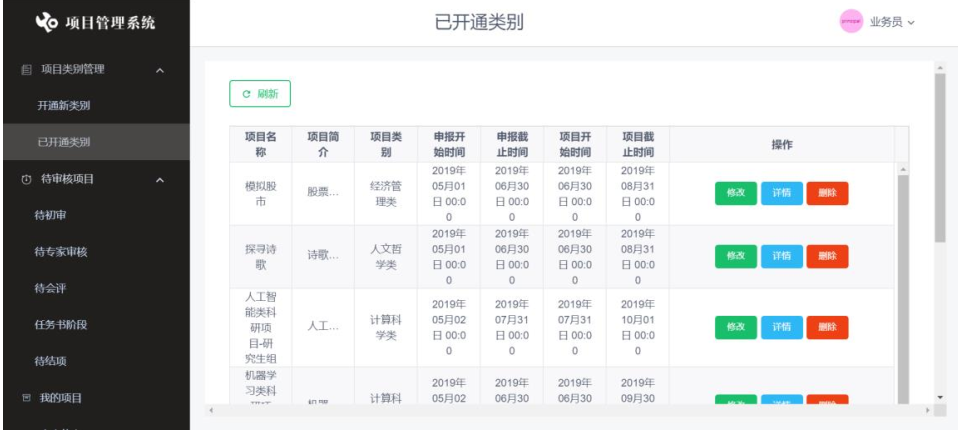

## 基于Web的校园项目管理系统
### 项目介绍
+ 随着信息技术在管理上越来越深入而广泛的应用， 自动化信息管理的实施在技术上已
  逐步成熟。高校的校园项目包括科研项目、社会调研、学术竞赛等，其管理工作是高校教育
  教学活动的一个重要组成部分，肩负着组织调研、项目立项申请、实施管理、以及评估科研
  人员科技工作的质与量等重要责任。我们经过对上海大学科研及竞赛项目从申报、审核到结
  项的情况进行分析，发现如下存在的问题：
  + （ 1）传统的高校校园项目管理模式效率低下，无法适应当前各类竞赛和科研项目管理
    模式，利用计算机支持高校各类竞赛和科研信息管理，已成为高校需迫切解决的问题
  + （ 2）相关竞赛及科研平台分布杂而乱，有需求相关系统能够整合校园相关项目的管理
    工作
+ 本项目从全国各大高校校园项目管理的现状以及国内外研究情况出发，对高校科研项目
  管理的需求及业务流程进行分析，包括校园科研、调研和竞赛项目的申报、评审、立项、研
  究过程管理等进行调查分析，采用软件工程方法和面向对象的思想对校园项目管理系统进
  行系统分析与设计，包括系统所涉及的网络体系结构、功能模块等关键技术。最后采用目前
  市面主流的 Web 开发技术实现了基于 Web 的高校校园项目管理系统的相关功能。
### 项目特色
+ 该系统采用三层 B/S 架构，将实现人机界面的所有表单和组件放在表示层，将所有业务
  规则和逻辑实现封装在负责业务逻辑组件中，将所有数据库的交互封装在数据访问控制组件
  中。 迅速准确的完成各种科研及竞赛等项目信息的管理工作
+ 而本系统的优势在于其采用了目前比较流行的前后端分离开发技术，前后端都使用流
  行的开发框架，并且前端通过 Axios 调用后端 Restful Api 接口并使用 json 进行数据交互。
  可以实现真正的前后端解耦，前端服务器使用 NGINX 控制页面引用、跳转、路由，页面异
  步调用后端的接口。 后端/应用服务器使用 Tomcat， 使用主流 Spring 框架与前端进行交互并
  且依赖目前流行的 Docker 容器技术及 Jenkins 持续化技术部署在服务器中，技术上的使用
  使系统整体更加稳定、 响应速度更快、扩展性更强及维护运营更方便。
### 项目角色
+ 普通用户： 项目的参与者或者参赛者，主要功能包括项目申请、项目立项后提交相关文档等操作。
+ 业务员：主要负责普通用户提交的项目初审的工作，主要功能包括开通项目大类、审核项目申请、审核立项项目相关文档等。
+ 评审专家：主要负责对项目评审与打分，主要功能包括评审项目申请和相关文档，填写相关意见并打分等
+ 领导： 项目立项和结题的最终抉择者，主要功能包括审核项目申请和相关文档，终审项目等。
+ 管理员： 负责系统的人员的调配与角色管理。
### 界面展示
+ 1.登录界面: 

+ 2.用户端界面

+ 3.业务端界面

+ 4.领导端界面

+ 5.专家端界面

+ 6.管理员端页面
